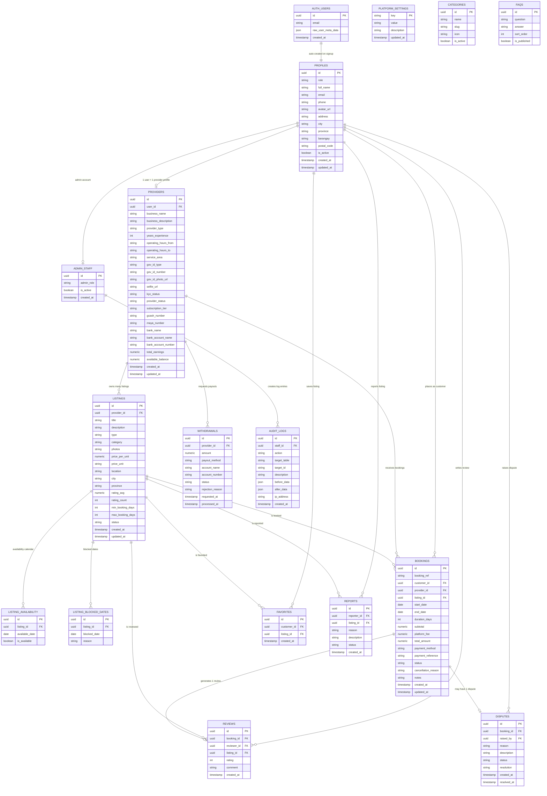

# ServiceQ — Entity Relationship Diagram (ERD)

> Database: **Supabase PostgreSQL**  
> All tables use **UUID** primary keys. `auth.users` is managed by Supabase Auth.

---

## ERD Diagram



---

## Table Descriptions

| Table | Purpose | Key Relationships |
|---|---|---|
| **`auth.users`** | Supabase Auth — stores login credentials | Auto-links to `profiles` via trigger |
| **`profiles`** | All user info (customer / provider / admin) | Extends `auth.users` 1:1 |
| **`providers`** | Provider-specific data (KYC, payout, subscription) | 1:1 with `profiles` |
| **`listings`** | All service and rental listings | Belongs to `providers` |
| **`listing_availability`** | Day-by-day availability calendar per listing | Belongs to `listings` |
| **`listing_blocked_dates`** | Dates blocked by provider (holidays, etc.) | Belongs to `listings` |
| **`bookings`** | Booking transactions linking customer ↔ provider ↔ listing | Links 3 tables |
| **`reviews`** | Customer ratings and comments after a booking | 1:1 with `bookings` |
| **`favorites`** | Customer wishlists / saved listings | Links `profiles` ↔ `listings` |
| **`withdrawals`** | Provider payout requests | Belongs to `providers` |
| **`disputes`** | Booking disputes raised by customers or providers | 1:1 with `bookings` |
| **`reports`** | Content reports on listings | Links `profiles` ↔ `listings` |
| **`admin_staff`** | Admin accounts with roles | Extends `profiles` |
| **`audit_logs`** | Immutable record of every admin action | Belongs to `admin_staff` |
| **`platform_settings`** | Key-value store for global settings (fee %, etc.) | Standalone |
| **`categories`** | Listing categories (Services, Gadgets, etc.) | Standalone |
| **`faqs`** | Frequently asked questions content | Standalone |

---

## Relationship Summary

```
AUTH_USERS (Supabase Auth)
    └── PROFILES (1:1)
            ├── PROVIDERS (1:1) — role = provider
            │       ├── LISTINGS (1:many)
            │       │       ├── LISTING_AVAILABILITY (1:many)
            │       │       ├── LISTING_BLOCKED_DATES (1:many)
            │       │       ├── REVIEWS (1:many)
            │       │       ├── FAVORITES (1:many)
            │       │       └── REPORTS (1:many)
            │       ├── BOOKINGS (1:many) ← receives
            │       └── WITHDRAWALS (1:many)
            ├── BOOKINGS (1:many) ← places as customer
            │       ├── REVIEWS (1:1)
            │       └── DISPUTES (1:1)
            ├── FAVORITES (1:many)
            ├── REPORTS (1:many)
            └── ADMIN_STAFF (1:1) — role = admin
                    └── AUDIT_LOGS (1:many)
```

---

## ENUM Reference

| ENUM | Values |
|---|---|
| `user_role` | `customer`, `provider`, `admin` |
| `provider_status` | `under_verification`, `approved`, `rejected`, `suspended` |
| `listing_type` | `service`, `rental_property`, `rental_item` |
| `listing_status` | `active`, `inactive`, `pending`, `archived` |
| `booking_status` | `pending`, `scheduled`, `active`, `completed`, `cancelled` |
| `payment_method` | `gcash`, `maya`, `bdo`, `bpi`, `metrobank` |
| `withdrawal_status` | `pending_review`, `verified`, `approved`, `processing`, `completed`, `rejected` |
| `subscription_tier` | `free`, `basic`, `premium` |
| `admin_role` | `superadmin`, `financial_staff`, `support_moderator` |
